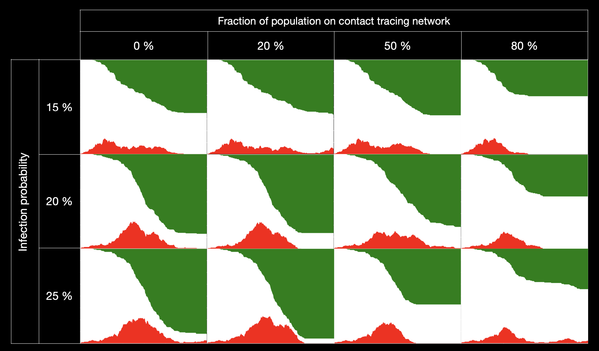

# Description

Context : COVID-19 in [March 2020](https://imgur.com/gallery/c4jt321). COVID-19 in [November 2020](https://imgur.com/gallery/ZzmZP).

There has been much discussion recently about the potential for "digital" herd immunity using contact tracing and cellphones. See for example Bulchandani, Vir B., et al., [arXiv:2004.07237, 2020](https://arxiv.org/abs/2004.07237). We wanted to see if we could use a simple particles in a box simulation to model the spread of an epidemic, and use graph theory to design an efficient algorithm for contact tracing.

For a range of box, particle, and disease parameters, a "patient zero" begins to infect others in the box. Infected individuals stay in the box, infecting others, throughout the pre-symptomatic phase of the disease. They isolate once they develop symptoms. Nevertheless, the epidemic spreads. We implement a contact tracing network for a fraction of the population to alert people who have been in contact with a sick person, telling them to get tested. This allows us to isolate these people while they are still pre-symptomatic, thus better controling the epidemic.

This project was created in 24 hours in the context of the [2020 McGill Physics Hackathon](https://mcgill-phys-hack-2020.devpost.com/). Our presentation can be found [here](https://docs.google.com/presentation/d/17Kg3ZbL9Zi1OP43e3IJKF2CRj9mVGUQkKq1wJyNFFqk/edit?usp=sharing).

### The team
[Mathieu Bergeron](https://github.com/fasttachyon) - MSc. student at Université de Sherbrooke    
[Oscar Céspedes](https://github.com/oscar-CV) - MSc. student at Polytechnique Montréal            
[Simon Guichandut](https://github.com/simonguichandut) - PhD. student at McGill University            
[Gabriel Laberge](https://github.com/gablabc) - PhD. student at Polytechnique Montréal       

# How-to
Define simulations parameters in main.py. Run the simulation with

    python3 main.py

Make movies with

    python3 make_movies.py mp4

(can replace mp4 with gif)

# Example results  
Healthy individuals are in white, infected in red, immune in green. In the box plot simulations, circles are individuals not on the contact tracing network, triangles are on the network. Time is indicated in the top left, in iteration number and fraction of the infection time (patient zero becomes green after 1 IT).

In simulations where there is contact tracing, the network only begins after 70 iterations, to allow the epidemic to have an initial, unconstrained, spread.

The same random seed, which generates initial positions and velocities, is used in each simulation to minimize random fluctuations.

## No contact tracing 

Almost 90% of the population has been infected.

## 20% contact tracing

With only some contact tracing, there is no significant improvement. 

## 50% contact tracing

The contact tracing network is starting to be effective! The infection curve has been flattened. Still, many individuals end up being infected.

## 80% contact tracing

The true power of contact tracing becomes apparent once a threshold fraction of the population on the network is passed! For these sets of parameters, the threshold is close to 80%.

## Parameter space

The higher the infection rate is, the higher the CN network adoption threshold is. This phase transition warrants further investigations.

# To-do

- We could further demonstrate the power of contact tracing by introducing a new patient zero in a population where the epidemic has been contained.

- Switch to a better algorithm to evolve particles.

- What happens if individuals are only immune for a finite time?
